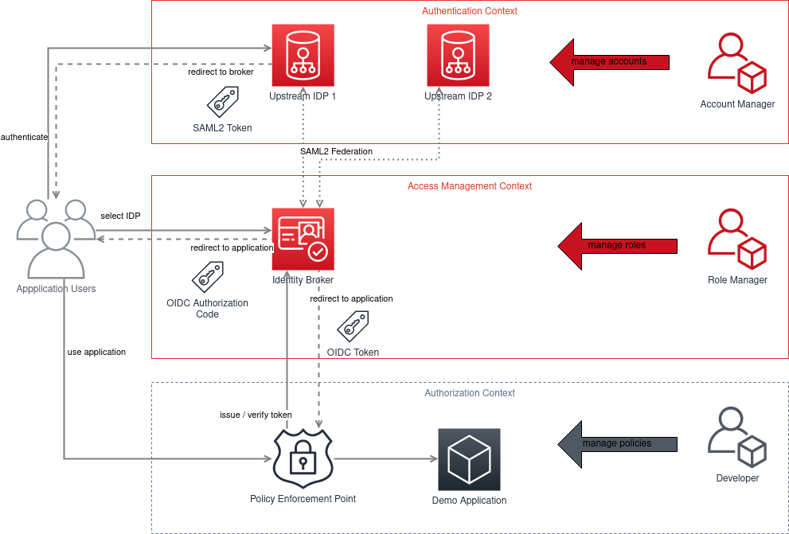

# brokerage-aaa-demo

This project is demonstrating how to setup authentication, authorization and access control using a brokerage. With a brokerage the authentication will be delegated to an upstream idp.
* Authentication is happening using a keycloak with this realms
 * upstreamidp1 for user base 1
 * upstreamidp2 for user base 2
* Authorization is happening using
 * keycloak-proxy which is protecting the access to an example application
* Access Control is happening using a keycloak which acts a a broker. it is in charge of
 * defining the roles for dedicated users.


# Requirements
* some linux distribution like Arch Linux or Debian
* docker
* docker-compose
* [cfssl](https://github.com/cloudflare/cfssl)


# Components

The used components are used as docker container and will be started using docker-compose:

* [traefik](https://traefik.io)
* [caddy](https://caddyserver.com)
* [postgresql](https://postgresql.org)
* [keycloak](https://keycloak.org)
* [keycloak](https://keycloak.org)
* [keycloak-gatekeeper](https://github.com/keycloak/keycloak-gatekeeper)
* [httpbin](https://httpbin.org)


# Architecture

The overall architecture looks like this:


These roles are known
* application user - authenticates and is using the application
* security account manager - manages accounts in IAM systems
* security role manager - manages the roles in the broker
* developer - has developed the application and is the defining the policies for an authorization


# Preperation

Add necessary host entries to /etc/host file
```
127.0.0.1       debug.aaa.demo
127.0.0.1       app.aaa.demo
127.0.0.1       api.keycloak.aaa.demo mgmt.keycloak.aaa.demo
```

# How to start the demo?

Run `./start.sh`

It starts several services:
1. postgres database
2. keycloak with 4 realms [https://api.keycloak.aaa.demo](https://api.keycloak.aaa.demo)
3. keycloak-gatekeeper [https://app.aaa.demo](https://app.aaa.demo) with protects the demo application
4. demo application
5. httpbin for debugging [https://debug.aaa.demo](https://debug.aaa.demo)
6. traefik as a lightweight [loadbalancer](http://localhost:3000)

# How to use the demo application?

1. Access [http://app.aaa.demo](https://app.aaa.demo). You will be redirected to the Broker
2. Login directly at the broker or at another upstream idp. You are logged in and will be redirected back to the demo application


# How to manage user access?
1. Access [http://api.keycloak.aaa.demo](https://api.keycloak.aaa.demo). 
2. login with admin user from *Keycloak Master*
3. Go to "Manage Users" on left menu
4. Select a user and click the button *edit*
5. Go to roles tab


# Credentials

## Keycloak Master
* admin / 11111111

## Keycloak Broker
* brokeruser1 / brokeruser1

## Keycloak UpstreamIDP1
* idp1user1 / idp1user1

## Keycloak UpstreamIDP2
* idp2user1 / idp2user1


# Links

* Keycloak Broker SAML SP Descriptor URL for Upstreamidp1
 * https://api.keycloak.aaa.demo/auth/realms/broker/broker/broker-upstreamidp1-saml/endpoint/descriptor
* Keycloak Broker SAML SP Descriptor URL for Upstreamidp2
 * https://api.keycloak.aaa.demo/auth/realms/broker/broker/broker-upstreamidp2-saml/endpoint/descriptor
* Keyclaok Upstreamidp1 SAML IDP Descriptor URL
 * https://api.keycloak.aaa.demo/auth/realms/upstreamidp1/protocol/saml/descriptor
* Keyclaok Upstreamidp2 SAML IDP Descriptor URL
 * https://api.keycloak.aaa.demo/auth/realms/upstreamidp2/protocol/saml/descriptor
